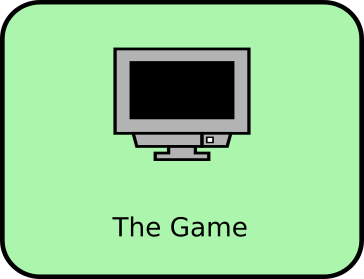

## The Game

This chapter deals with the software for the Robot Devastation game. 

### Chapter Summary
* [The Game](software.md)
  * [Robot Devastation Overview](general-architecture.md)
    * [HUB class](general-architecture/hub-class.md)
  * [Game FSM](game-fsm.md)
    * [Init State](init-state.md)
    * [Game State](game-state.md)
    * [Dead State](dead-state.md)
    * [Finite State Machine](finite-state-machine.md)
  * Sound Management
  * Input Management
  * [Network Management](network-management.md)
    * [Network](network.md)
  * Robot Management
  * User Interface Management
  * Camera Management
  * [Data Management](data-management.md)
  * [Tests](tests.md)

